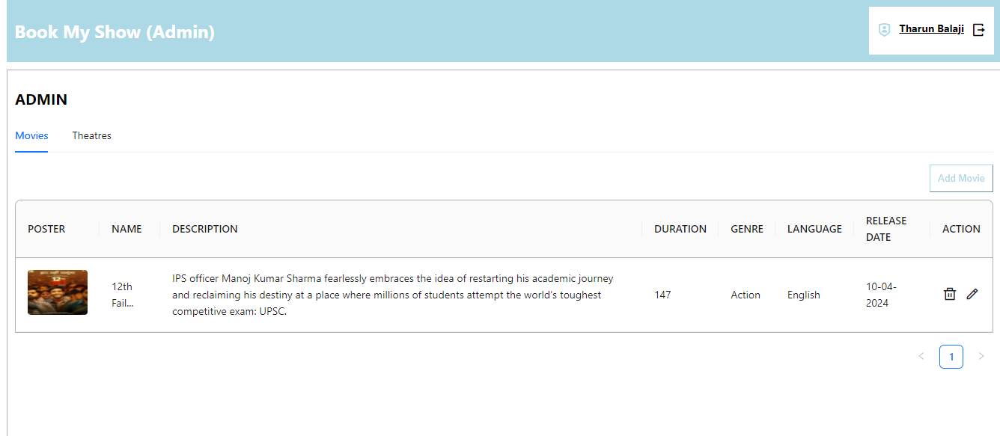

# BookMyShow Clone - Movie Ticket Booking System

A full-stack MERN application that replicates the core functionalities of BookMyShow, allowing users to book movie tickets, select seats, and make payments. Theater owners can add their theaters and shows with admin approval.

## Features

### User Features
- **Authentication**
  - User registration and login
  - JWT-based authentication
  - Encrypted passwords using bcryptjs

- **Movie Booking**
  - Browse available movies and shows
  - View theater locations and showtimes
  - Interactive seat selection
  - Secure payment processing via Stripe
  - Booking history

### Theater Owner Features
- Add new theaters
- Manage shows and timings
- Theater details management

### Admin Features
- Approve/reject theater registrations
- Manage movies and shows
- User management
- Booking analytics

## 🖥️ Live Demo

[View Live Application](https://bms-deploy.onrender.com/)

## Tech Stack

### Frontend
- **React.js** - Frontend library
- **Redux** - State management
- **Ant Design** - UI components
- **Axios** - API requests
- **React Router** - Navigation
- **Moment.js** - Date/time formatting
- **Stripe** - Payment integration

### Backend
- **Node.js** - Runtime environment
- **Express.js** - Backend framework
- **MongoDB** - Database
- **Mongoose** - ODM for MongoDB
- **JWT** - Authentication
- **bcryptjs** - Password encryption

## Installation

1. Clone the repository
```bash
git clone https://github.com/yourusername/bookmyshow-clone.git
cd bookmyshow-clone
```

2. Install dependencies for backend
```bash
cd backend
npm install
```

3. Install dependencies for frontend
```bash
cd frontend
npm install
```

4. Configure environment variables
```env
# Backend .env
MONGODB_URI=your_mongodb_uri
JWT_SECRET=your_jwt_secret
STRIPE_SECRET_KEY=your_stripe_secret_key

# Frontend .env
REACT_APP_API_URL=http://localhost:5000
REACT_APP_STRIPE_PUBLIC_KEY=your_stripe_public_key
```

5. Start the servers
```bash
# Start backend server
cd backend
npm start

# Start frontend server
cd frontend
npm start
```

## Project Structure
```
bookmyshow-clone/
├── frontend/
│   ├── public/
│   ├── src/
│   │   ├── components/
│   │   ├── pages/
│   │   ├── redux/
│   │   ├── services/
│   │   └── utils/
│   └── package.json
│
├── backend/
│   ├── models/
│   ├── routes/
│   ├── controllers/
│   ├── middleware/
│   └── server.js
│
└── README.md
```

## API Endpoints

### Auth Routes
- `POST /api/auth/register` - User registration
- `POST /api/auth/login` - User login

### Movie Routes
- `GET /api/movies` - Get all movies
- `GET /api/movies/:id` - Get movie details

### Theater Routes
- `POST /api/theaters` - Add new theater
- `GET /api/theaters` - Get all theaters
- `PUT /api/theaters/:id` - Update theater

### Booking Routes
- `POST /api/bookings` - Create new booking
- `GET /api/bookings/user` - Get user bookings
- `POST /api/bookings/payment` - Process payment

## Database Schema

### User Schema
```javascript
{
  name:String,
  email:String,
  isAdmin:Boolean,
  password : String
}
```

### Theater Schema
```javascript
{
  name:String,
  email: String,
  address: String,
  phone: Number,
  isActive: Boolean,
  owner: UserSchema
}
```

### Movie Schema
```javascript
{
  title:String,
  description:String,
  genre: String,
  language:String,
  poster: String,
  releaseDate: Date
  duration:Number
}
```

## 🖼️ Preview

### Login Page
[]

### Sign-up Page


### Home Page


### Admin Dashboard


### Admin Theater Details


### Available Movies


### Movie Details


### Booking


### Payment


### Bookings


### Booking History


### Add Theater


## Future Enhancements
- Mobile responsive design
- Email notifications
- Movie ratings and reviews
- Multiple language support
- Social media authentication
- Advanced search filters

## Contributing

1. Fork the repository
2. Create your feature branch (`git checkout -b feature/AmazingFeature`)
3. Commit your changes (`git commit -m 'Add some AmazingFeature'`)
4. Push to the branch (`git push origin feature/AmazingFeature`)
5. Open a Pull Request

## License

This project is licensed under the MIT License - see the [LICENSE.md](LICENSE.md) file for details.

## Contact

Email - [tharunbalaji110@gmail.com](mailto:tharunbalaji110@gmail.com)

Project Link: [https://github.com/tharunbalaji110/bookmyshow-clone](https://bms-deploy.onrender.com/)

## Acknowledgments
- Inspired by BookMyShow
- [Ant Design](https://ant.design/)
- [Stripe Documentation](https://stripe.com/docs)
- [MongoDB Documentation](https://docs.mongodb.com/)